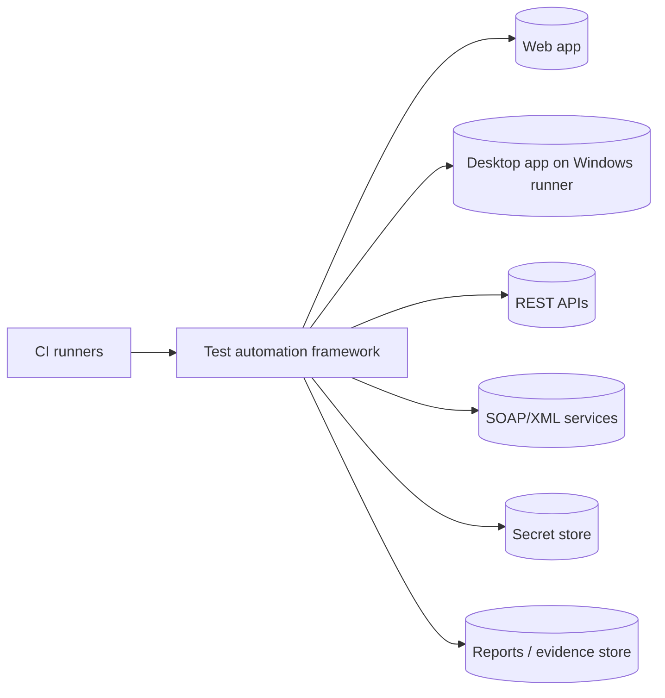
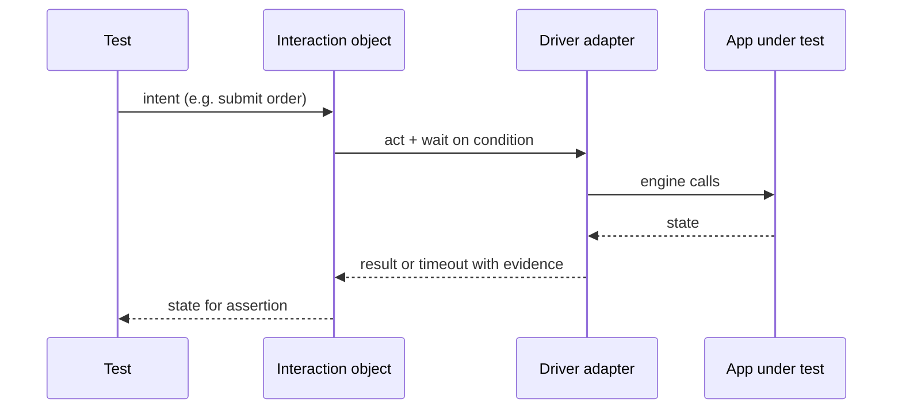

# HLD: <test automation framework or major capability>

Status: Draft | Approved        Owner: <human>        Specs: <links>        ADRs: <links>

## 1. Context and goals
- Applications under test per platform (web, desktop, REST, XML/SOAP):
- Environments, CI, grids/runners, secret store, reporting/test management systems:
- In scope / out of scope:

## 2. Quality attributes (measurable)
| Attribute | Target | How measured |
|---|---|---|
| Smoke duration | < __ min | CI job time |
| Regression duration | < __ min at __ workers | nightly job time |
| Flake rate | < __ % | flaky_report over repeated runs |
| Diagnosability | root cause identifiable from evidence in < __ min | triage sample |
| Maintainability | a UI change touches one interaction object | design review |
| Portability | browsers __ · OS __ · desktop tech __ | CI matrix |
| Security | no secrets/PII in artifacts; no production targets | redaction + allow-list tests |

## 3. Context diagram

## 4. Layers and responsibilities
| Layer | Single responsibility | May import | Owns libraries |
|---|---|---|---|
<!-- Encode exactly this table in docs/design/layers.toml -->

## 5. Ports and adapters
| Port (Protocol) | Capabilities | Adapters | Contract test suite |
|---|---|---|---|

## 6. Composition and configuration
<!-- Where drivers/clients are built (fixtures/plugin), configuration hierarchy, environment allow-list. -->

## 7. Execution model
<!-- xdist workers, grid, desktop session constraints, destructive tests, timeouts at each level. -->

## 8. Test data
<!-- Factories, uniqueness per worker, seeding, cleanup, synthetic PII, stubs. -->

## 9. Evidence and reporting
<!-- Per platform capture, redaction, retention, reporting sink, traceability. -->

## 10. Key flows

## 11. Failure modes
| Failure | Detection | Behavior | Recovery |
|---|---|---|---|
| Environment down | pre-suite health check | fail fast, one clear error | rerun after fix, recorded |
| Grid/runner capacity | session creation errors | infrastructure retry, counted | scale or queue |
| Desktop session locked | launch/focus failure | fail with screen evidence | runner config |
| Schema drift | contract validation | fail with diff | defect or ADR |

## 12. Alternatives and ADRs

## 13. Risks and open questions
- [ ]

## Sign-off
- [ ] design-reviewer    - [ ] human architect    - [ ] automation-security-reviewer
