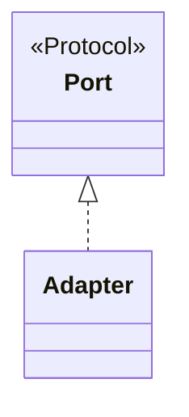

# LLD: <component, interaction object family, adapter, or fixture family>

Status: Draft | Approved        HLD: <link>        Spec / task: <link, AC-n>
Required for new or changed modules, classes, Protocols, fixture families, or data models.

## 1. Scope

## 2. Module map
| File | Single responsibility | Layer (layers.toml) | New / changed |
|---|---|---|---|

## 3. Public interfaces
```python
class OrdersService(Protocol):
    def create(self, order: NewOrder) -> ApiResult[Order]: ...
```

## 4. Models and invariants
| Model | Fields (types) | Invariants | Frozen? |
|---|---|---|---|

## 5. Fixtures
| Fixture | Scope | Yields | Cleanup | Parallel-safe how |
|---|---|---|---|---|

## 6. Synchronization, errors, evidence
| Situation | Condition awaited / exception raised | Timeout | Message | Evidence |
|---|---|---|---|---|

## 7. Structure


## 8. SOLID check
| Principle | Evidence (or N/A reason) |
|---|---|
| Single responsibility | |
| Open/closed | |
| Liskov substitution (contract tests) | |
| Interface segregation | |
| Dependency inversion | |

## 9. Simplicity check
- Abstractions and their concrete reason (second implementation, test seam, volatile engine boundary):
- Simpler alternative rejected and why:

## 10. Tests
| Test | Marker | Fake or real engine | Covers |
|---|---|---|---|

## Sign-off
- [ ] design-reviewer    - [ ] human reviewer
